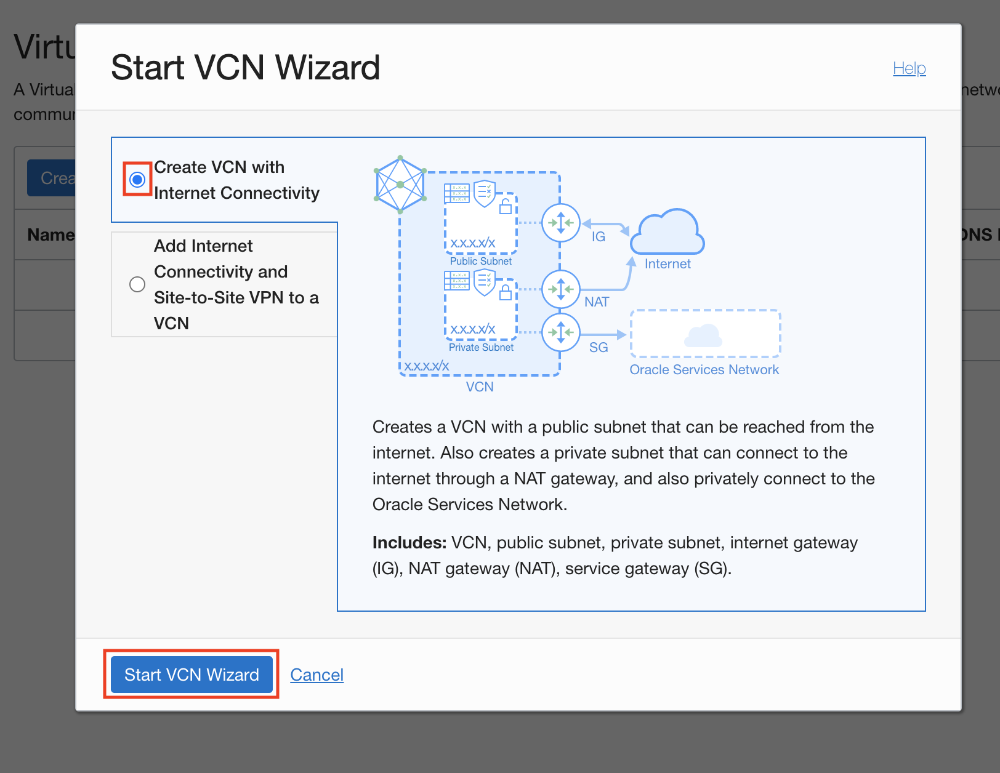

# Setup VCN

## Introduction

Oracle Cloud Infrastructure Compute lets you create multiple Virtual Cloud Networks (VCNs). These VCNs will contain the security lists, compute instances, load balancers and many other types of network assets.

Be sure to review [Overview of Networking](https://docs.cloud.oracle.com/iaas/Content/Network/Concepts/overview.htm) to gain a full understanding of the network components and their relationships.

Estimated Lab Time: 5 minutes

**Note:** *Some of the UIs might look a little different than the screen shots included in the instructions, but you can still use the instructions to complete the hands-on labs.*

### Objectives

* Setup VCN with wizard

### Prerequisites

To sign in to the Console, you need the following:

- Tenant, User name and Password
- URL for the Console: [https://console.us-ashburn-1.oraclecloud.com/](https://console.us-ashburn-1.oraclecloud.com/)
- Oracle Cloud Infrastructure supports the latest versions of Google Chrome, Firefox and Internet Explorer 11. ***It does not support the Edge browser***.

## Task 1: Create Your VCN

To create a VCN on Oracle Cloud Infrastructure:

1. Click the menu button on the Oracle Cloud Infrastructure console home page. Click **Networking** -> **Virtual Cloud Networks**.

	

2. Click **Start VCN Wizard**.

    

2. Select **Create VCN with Internet Connectivity**, and then click **Start VCN Wizard**.

    

3. Complete the following fields:

    |                  **Field**              |    **Value**  |
    |----------------------------------------|:------------:|
    |VCN NAME |FormsTOApexVCN|
    |COMPARTMENT |  Choose your compartment
    |VCN CIDR BLOCK|10.0.0.0/16|
    |PUBLIC SUNBET CIDR BLOCK|10.0.2.0/24|
    |PRIVATE SUNBET CIDR BLOCK|10.0.1.0/24|
    |USE DNS HOSTNAMES IN THIS VCN| Checked|

    Your screen should look similar to the following:
    

4. Press the **Next** button at the bottom of the screen.

5. Review your settings to be sure they are correct.
    

6. Press the **Create** button to create the VCN. It will take a moment to create the VCN and a progress screen will keep you apprised of the workflow.

    

7. Once you see that the creation is complete (see previous screenshot), click on the **View Virtual Cloud Network** button.

You may now **proceed to the next lab**.

## Summary

This VCN will contain all of the other assets that you will create during this set of labs. In real-world situations, you would create multiple VCNs based on their need for access (which ports to open) and who can access them.

## Acknowledgements

 - **Author** -  Vanitha Subramanyam, Senior Solution Architect
 - **Contributors** - Abhinav Jain, Staff Cloud Engineer, Sakthikumar Periyasamy Senior Cloud Engineer, Nayan Karumuri Staff Cloud Engineer
 - **Last Updated By/Date** - Kamryn Vinson, March 2022
