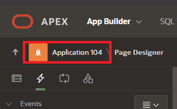
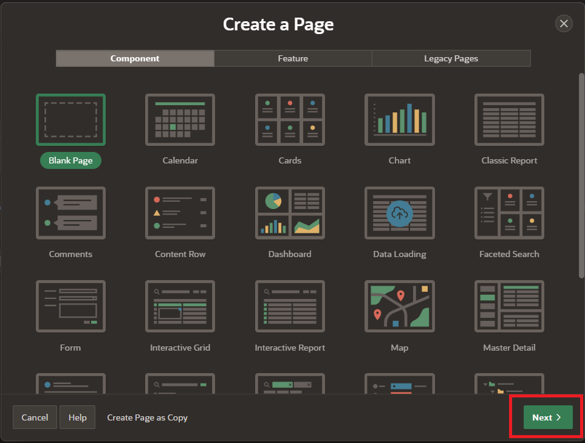
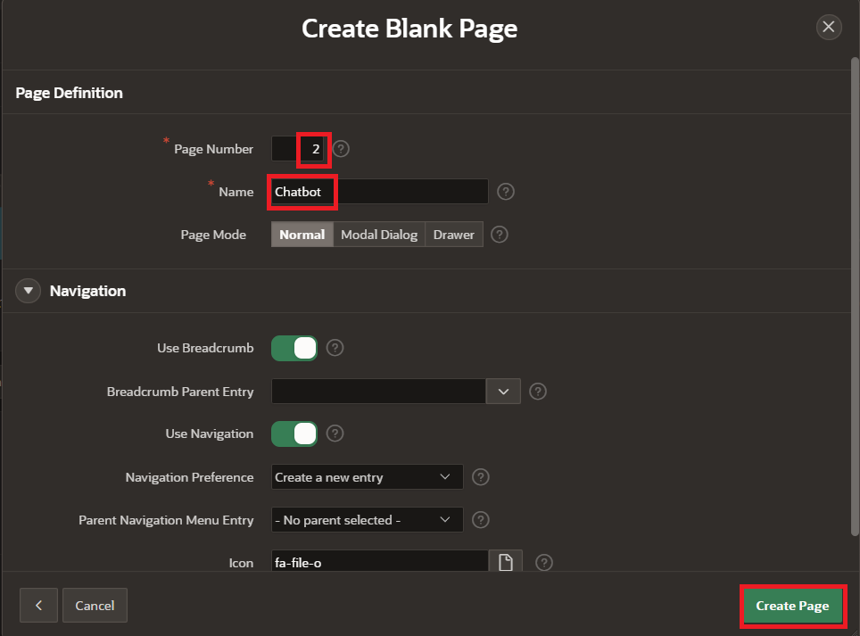

# Build a RAG Chatbot using Low-Code APEX

## Introduction

This lab walks the user througth part 2 of the APEX app development where the user creates the chatbot page.  

Estimated time - 45 minutes

### Objectives

* Create the Chatbot
* Create the Citations Page
* Test Chatbot
* (Optional) Enhance the UI Aesthetically

### Prerequisites

* An OCI cloud account
* Subscription to US-Central Chicago Region

## Task 1: Create the 

1. Navigate to the App Homepage and select **Create New Page**.

	

	

2. Select **Next** and leave the blank page template selected as default. 

	

3. Change the **page number to 2** and name the page **Chatbot**. Select **next** to build the page.

	

4. Create region by right-clicking the **body** in rendering pane and selecting **Create Region**. Name the region **Chatbot**.

	

	

5. Right-click the new region ChatBot and select **Create Page Item**. Name the page item **P2_ANSWER** and select type as **Hidden**.

	

6. Right Click **ChatBot Region** and select **Create Sub Region**. Modify the following on the right panel: 
	* **Name:** Chat
	* **Type:** Classic Report
	* **Source: Type:** SQL Query
	* **Appearance:** CSS Classes: t-Chat
	* **SQL Query:**
	```
	<copy>
	select c001          as user_name,
		c003          as comment_text, 
		c004          as comment_date,
		case when c001 = :APP_USER then apex_string.get_initials(:APP_USER)
		else 'CB'
		end user_icon,
		case when c002 = 'Yes' then 'Citations'
		else null        
		end actions,
		null          as attribute_1,
		null          as attribute_2,
		null          as attribute_3,
		null          as attribute_4,
		case
		when c002 = 'No' then 't-Chat--own'
		else null
		end comment_modifiers,
		n001
	from apex_collections 
	where collection_name = :P2_COLLECTION_NAME
	order by seq_id asc
	</copy>
	```
	

	

	

Next we will create the Question Panel.

7. Right-click the **ChatBot Region** that we just created and select **Create Region**. Name the region **Question Panel**.

	

8. Right-click the new region: **Question Panel** and select **Create Page Item**. Update the following on the right side of the screen:
	* **Name:** P2_SESSION_ID
	* **Type:** Hidden

9. Right-click the same **Question Panel** and select **Create Page Item**. Update the following on the right side of the screen:
	* **Name:** P2_COLLECTION_NAME
	* **Type:** Hidden

10. Right-click the same **Question Panel** and select **Create Page Item**. Update the following on the right side of the screen:
	* **Name:** P2_SEQ_ID
	* **Type:** Hidden

11. Right-click the same **Question Panel** and select **Create Page Item**. Update the following on the right side of the screen:
	* **Name:** P2_QUESTION
	* **Type:** Text Field
	* **Settings:** Submit when Enter pressed: Enabled

12. Right-click the same **Question Panel** and select **Create Button**. Name the button **NEW_SESSION**.

13. Right-click the same **Question Panel** and select **Create Button**. Name the button **ASK**. Enable the **Hot** under appearance.

14. Create a **Processes** by selecting the **Process tab** and right-click **Processing**, selecting **Create Process**. Provide the following on the right side of the panel:
	* **Name:** Clear Session State
	* **Type:** Clear Session State

15. Create a **Server-side Condition** for when Button Pressed it will create a **New Session**.
	2. Create Chat Process
		1. Right Click Processing
		2. Create Process
			1. Name: Generate Response
			2. Type: Execution Chain
		3. Right Click GenerateResponse Process
			1. Add Child Process
			2. Name: Create Session if not exists
			3. PL/SQL Code


Thank you for completing this lab.

## Acknowledgements

* **Authors:**
	* Kevin Xie - Cloud Architect
	* Nicholas Cusato - Cloud Architect
	* Olivia Maxwell - Cloud Architect
	* Graham Shroyer - Cloud Architect
	* Rachel Ogle - Cloud Architect
* **Last Updated by/Date** - Nicholas Cusato, May 2025
