# Build a RAG Chatbot using Low-Code APEX

## Introduction

This lab walks the user througth part 2 of the APEX app development where the user creates the chatbot page.  

Estimated time - 45 minutes

### Objectives

* Create the Chatbot
* Create the Citations Page
* Test Chatbot
* (Optional) Enhance the UI Aesthetically

### Prerequisites

* An OCI cloud account
* Subscription to US-Central Chicago Region

## Task 1: Create the 

1. Navigate to the App Homepage and select **Create New Page**.

	

	

2. Select **Next** and leave the blank page template selected as default. 

	

3. Change the **page number to 2** and name the page **Chatbot**. Select **next** to build the page.

	

4. Create region by right-clicking the **body** in rendering pane and selecting **Create Region**. Name the region **Chatbot**.

	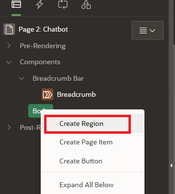

	

5. Right-click the new region ChatBot and select **Create Page Item**. Name the page item **P2_ANSWER** and select type as **Hidden**.

	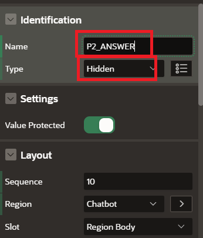

6. Right Click **ChatBot Region** and select **Create Sub Region**. Modify the following on the right panel: 
	* **Name:** Chat
	* **Type:** Classic Report
	* **Source: Type:** SQL Query
	* **Appearance:** CSS Classes: t-Chat
	* **SQL Query:**
	```
	<copy>
	select c001          as user_name,
		c003          as comment_text, 
		c004          as comment_date,
		case when c001 = :APP_USER then apex_string.get_initials(:APP_USER)
		else 'CB'
		end user_icon,
		case when c002 = 'Yes' then 'Citations'
		else null        
		end actions,
		null          as attribute_1,
		null          as attribute_2,
		null          as attribute_3,
		null          as attribute_4,
		case
		when c002 = 'No' then 't-Chat--own'
		else null
		end comment_modifiers,
		n001
	from apex_collections 
	where collection_name = :P2_COLLECTION_NAME
	order by seq_id asc
	</copy>
	```
	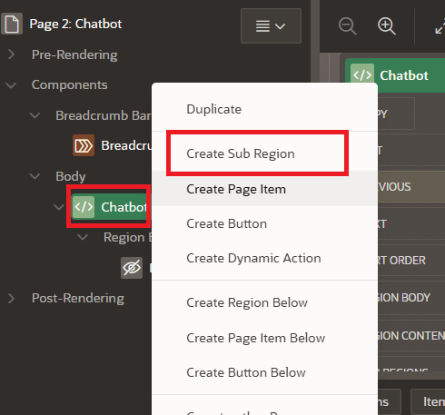

	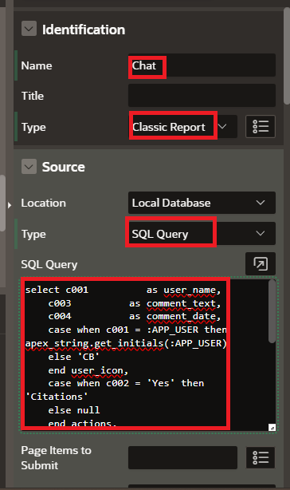

	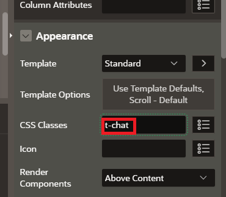

Next we will create the Question Panel.

7. Right-click the **ChatBot Region** that we just created and select **Create Sub Region**. Name the region **Question Panel**.

	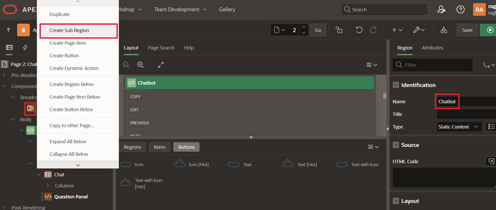

8. Right-click the new region: **Question Panel** and select **Create Page Item**. Update the following on the right side of the screen:
	* **Name:** P2_SESSION_ID
	* **Type:** Hidden

	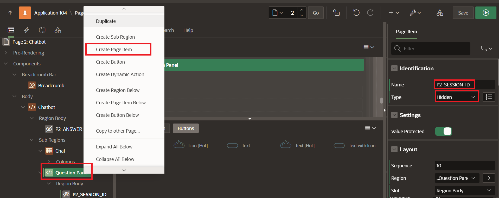

9. Right-click the same **Question Panel** and select **Create Page Item**. Update the following on the right side of the screen:
	* **Name:** P2_COLLECTION_NAME
	* **Type:** Hidden

	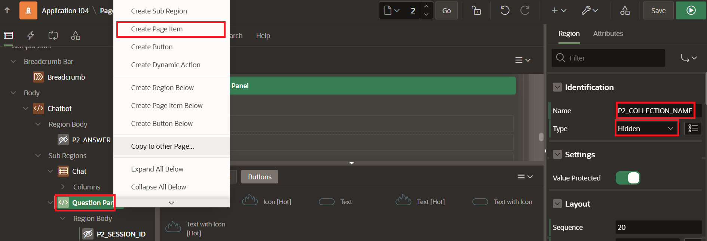

10. Right-click the same **Question Panel** and select **Create Page Item**. Update the following on the right side of the screen:
	* **Name:** P2_SEQ_ID
	* **Type:** Hidden

	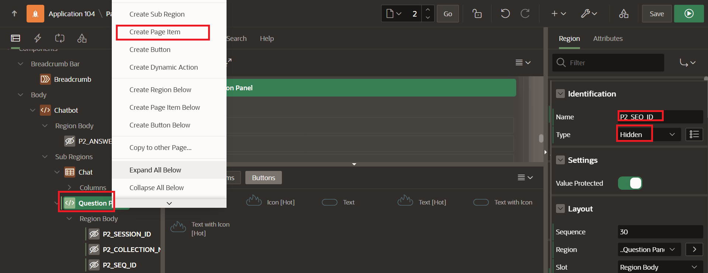

11. Right-click the same **Question Panel** and select **Create Page Item**. Update the following on the right side of the screen:
	* **Name:** P2_QUESTION
	* **Type:** Text Field
	* **Settings:** Submit when Enter pressed: Enabled

	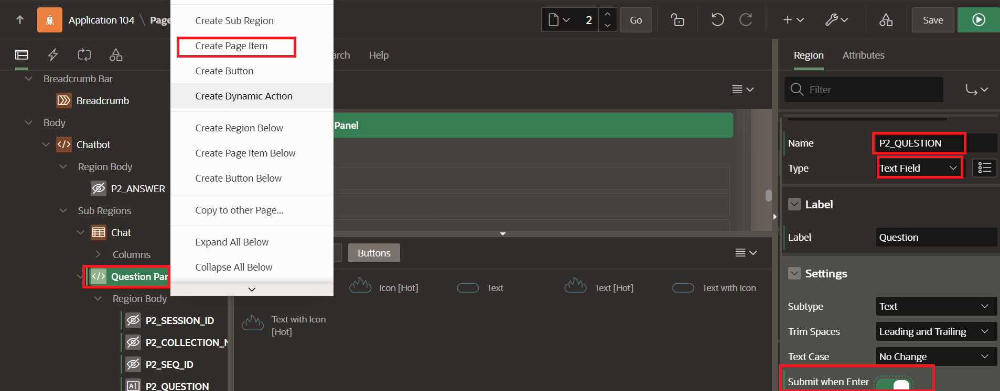

12. Right-click the same **Question Panel** and select **Create Button**. Name the button **NEW_SESSION**.

	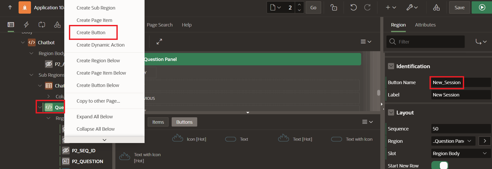

13. Right-click the same **Question Panel** and select **Create Button**. Name the button **ASK**. Enable the **Hot** under appearance.

	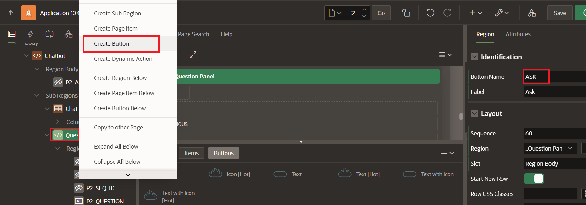

14. Create a **Processes** by selecting the **Process tab** and right-click **Processing**, selecting **Create Process**. Provide the following on the right side of the panel:
	* **Name:** Clear Session State
	* **Type:** Clear Session State

	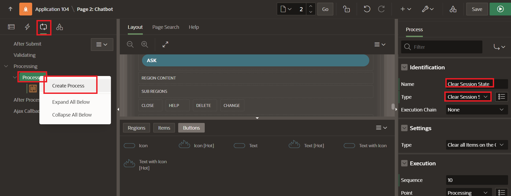

	* **Server-side Condition:** When button Pressed: New Session

	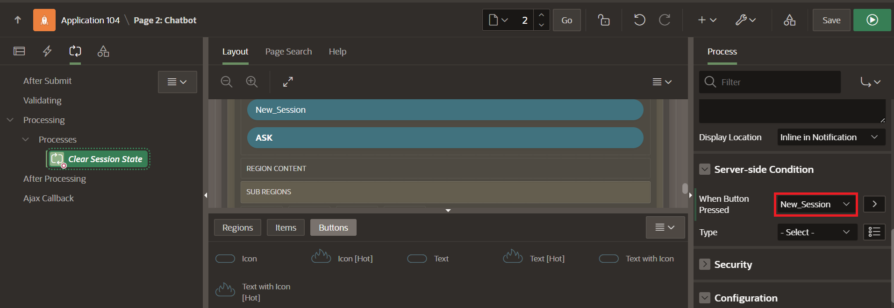

16. Right-click **Processing** again and select **Create Process**. Provide the following on the right side of the panel:
	* **Name:** Generate Response
	* **Type:** Execution Chain

	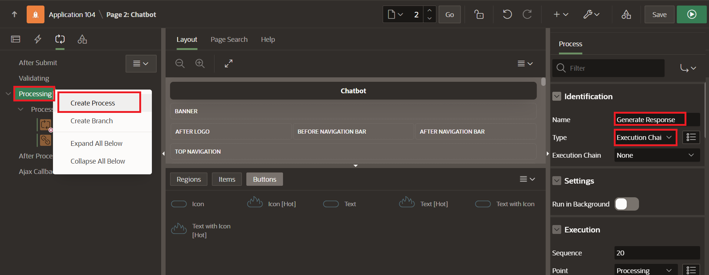

17. Right-click **GenerateResponse Process** and select **Add Child Process**. Provide the following on the right side of the panel:
	* **Name:** Create Session if not exists
	* **PL/SQL Code:**
	```
	<copy>
	declare
	 c_agent_endpoint_id constant varchar2(1024) :=
	  'ocid1.genaiagentendpoint.oc1.us-chicago-1.xxxxxxxxxx';
	 l_response clob;
	begin
	 apex_web_service.set_request_headers(
	  p_name_01 => 'Content-Type'
	  , p_value_01 => 'application/json'
	 );
	l_response := apex_web_service.make_rest_request(
	  p_http_method => 'POST'
	  , p_url =>
		'https://agent-runtime.generativeai.us-chicago-1.oci.oraclecloud.com'
		|| '/20240531/agentEndpoints/'
		|| c_agent_endpoint_id
		|| '/sessions'
	  , p_credential_static_id => 'api_key'
	  , p_body => json_object(
		key 'displayName' value 'AgentTester'
		, key 'description' value 'Application testing the GenAI Agent service.'
	  )
	 );
	if apex_web_service.g_status_code = 200 then
	  apex_json.parse(p_source => l_response);
	-- Store the session ID
	  :P2_SESSION_ID := apex_json.get_varchar2(p_path => 'id');
	-- Create a new APEX collection to store the question and response.
	  :P2_COLLECTION_NAME := 'SSID_' || to_char(systimestamp
	   , 'YYYYMMDDHH24MISS');
	  apex_collection.create_or_truncate_collection(
	   p_collection_name => :P2_COLLECTION_NAME
	  );
	 else
	  raise_application_error(-20001, 'Error creating session.');
	 end if;
	end;
						 4. Server-side condition
	</copy>
	```
	* **Server-side condition**
	* **Type:** Item is Null
	* **Item:** P2_SESSION_ID

	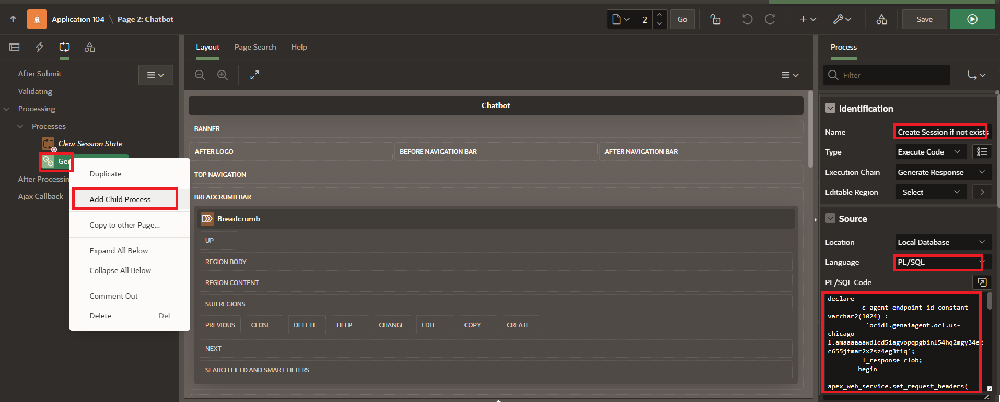

	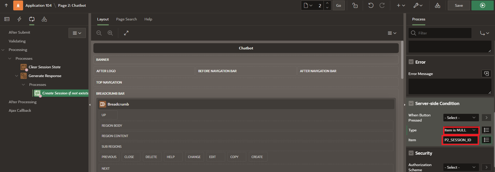	

18. Right-click **GenerateResponse** and select **Add Child Process**. Provide the following on the right side of the panel:
	* **Name:** Generate Response child
	* **PL/SQL Code:**
	```
	<copy>
	declare
	 c_agent_endpoint_id constant varchar2(1024) :=
	  'ocid1.genaiagentendpoint.oc1.us-chicago-1.xxxxxx';
	 l_response clob;
	 l_clean_response clob;
	begin
	 apex_web_service.set_request_headers(
	  p_name_01 => 'Content-Type'
	  , p_value_01 => 'application/json'
	 );
	l_response := apex_web_service.make_rest_request(
	  p_http_method => 'POST'
	  , p_url =>
		'https://agent-runtime.generativeai.us-chicago-1.oci.oraclecloud.com'
		|| '/20240531/agentEndpoints/'
		|| c_agent_endpoint_id
		|| '/actions/chat'
	  , p_credential_static_id => 'api_key'
	  , p_body => json_object(
		key 'sessionId' value :P2_SESSION_ID
		, key 'shouldStream' value 'false'
		, key 'userMessage' value apex_escape.json(:P2_QUESTION)
	  )
	 );
	if apex_web_service.g_status_code = 200 then
	  apex_json.parse(p_source => l_response);
	l_clean_response := JSON_VALUE(l_response, '$.message.content.text' returning varchar2);
	  -- Save the question and response to the question, and then save the
	  -- generated SEQ ID to the session state.
	:P2_SEQ_ID := apex_collection.add_member(
	   p_collection_name => :P2_COLLECTION_NAME,
	   p_c001 => :APP_USER,
	   p_c002 => 'No',
	   p_c003 => :P2_QUESTION,
	   p_c004 => to_char(sysdate, 'DD-MON-YYYY HH24:MI:SS'),
	   p_n001 => :P2_SEQ_ID+1
	  );
	:P2_SEQ_ID := apex_collection.add_member(
	   p_collection_name => :P2_COLLECTION_NAME,
	   p_c001 => 'CHATBOT',
	   p_c002 => 'Yes',
	   p_c003 => l_clean_response,
	   p_c004 => to_char(sysdate, 'DD-MON-YYYY HH24:MI:SS'),
	   p_n001 => :P2_SEQ_ID+1,
	   p_clob001 => l_response
	  );
	 end if;
	end;
	</copy>
	```

* **Note:** Be sure to update the first variable line (**c_agent_endpoint_id**) in the copy section above with the AI Agent OCID with the correct OCID from the OCI console.

	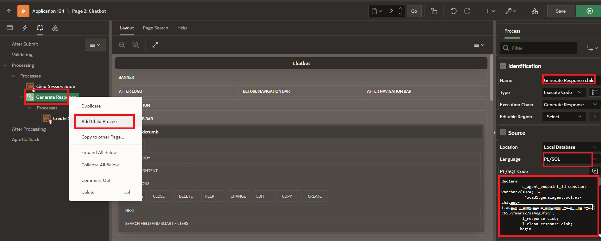

19. Click the **green button** at the top right of the page to save and run.

	


## Task 2: Create Citations Page 

1. Navigate back to the page we were editing. Create a new page by selecting the **plus sign drop down button** at the top right and select **Page**.

	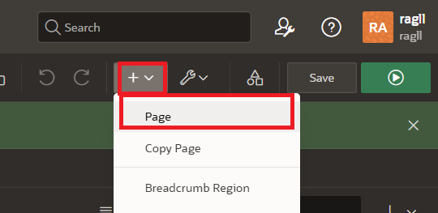

2. Select **Blank Page**, modify the following, and select **Create Page**:
	* **Page #:** 3
	* **Name:** Citations
	* **Page Mode:** Modal Dialog

	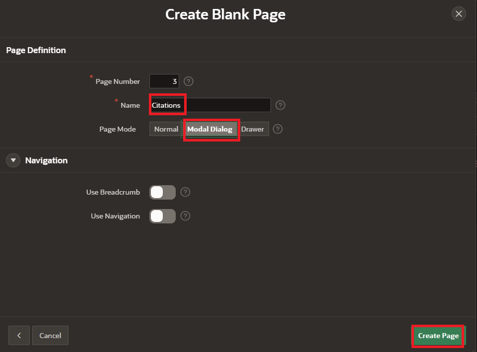

3. Click **Edit Page** and under **Appearance/Template Options**, click **Template Defaults**, and select **Stretch to Fit Window**. Select **Ok** to save.

	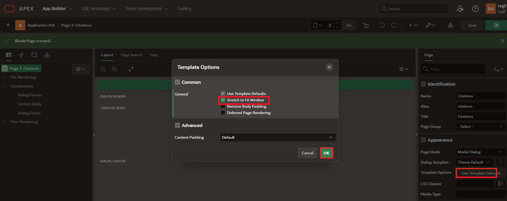

3. Right-click Components/Content Body ande select **Create Page Item**. Modify the following on the right side of the screen:
	* **Name:** P3_SEQ_ID
	* **Type:** Hidden

	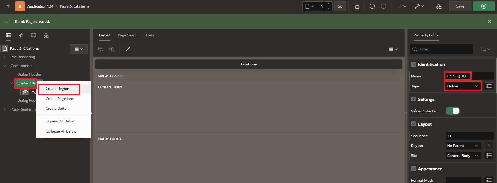

4. Create the Citation Region by right-clicking Components/Content Body and selecting **Create Region**. Modify the following on the right side of the screen:
	* **Name:** Citations
	* **Type:** Classic Report
	* **Source Type:** SQL Query
	* **SQL Query:**
	```
	<copy>
	select
	 ct.source_text
	 , ct.source_title
	 , ct.source_location_type
	 , ct.source_url
	from apex_collections c
	 , json_table(c.clob001, '$.message.content.citations[*]'
	   columns(
		source_text varchar2(32767) path '$.sourceText'
		, source_title varchar2(32767) path '$.title'
		, source_location_type varchar2(32767)
		  path '$.sourceLocation.sourceLocationType'
		, source_url varchar2(32767) path '$.sourceLocation.url'
	   )
	 ) ct
	where c.collection_name = :P2_COLLECTION_NAME
	and c.seq_id = :P3_SEQ_ID
	</copy>
	```

5. Click the **Save button** at the top right of the page.

6. Create a link to the Citations by first navigating back to page 2 by clicking the **nav bar** and selecting **2**.

7. Expand the Columns under the Chat Subregion
	3. Click Actions
	4. Change Type from Plain Text to Link
		1. Link target: Click No Link Defined
		2. Type: Page in this application
		3. Page: 3
		4. Set Items:
			1. Name: P3_SEQ_ID
			2. Value: #N001#
7. Save & Run (green) (edited) 

Thank you for completing this lab.

## Acknowledgements

* **Authors:**
	* Kevin Xie - Cloud Architect
	* Nicholas Cusato - Cloud Architect
	* Olivia Maxwell - Cloud Architect
	* Graham Shroyer - Cloud Architect
	* Rachel Ogle - Cloud Architect
* **Last Updated by/Date** - Nicholas Cusato, May 2025
